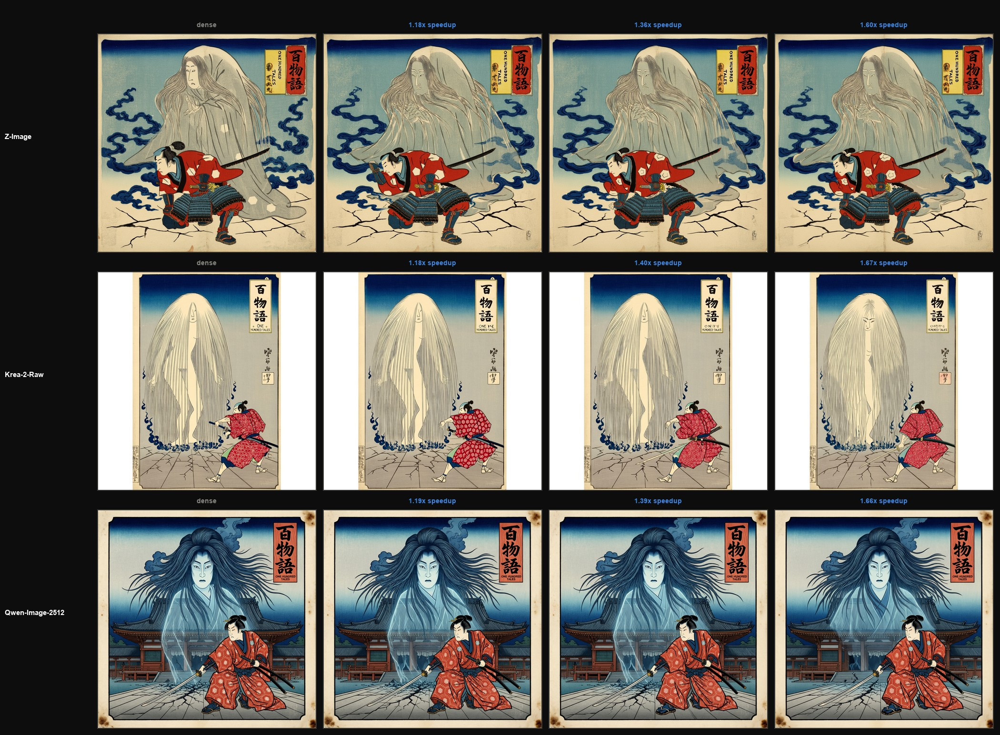

# Cascade Cache



## Install
```bash
pip install diffusers transformers torch triton 

# generate: dense reference + alt2 + alt3 + σ-threshold (3 budgets), over a prompt set
python -m CascadeCache.run --model qwen-image-2512 --schedule all --prompts-json prompts.json
```

or use it directly 
```python
from CascadeCache import get_adapter, load_pipeline, cascade_cache, schedule_alt

a = get_adapter("qwen-image-2512")
pipe = load_pipeline(a)
blocks = a.blocks(pipe)

sched = schedule_alt(period=2, late_start=0, n_blocks=len(blocks), n_steps=50)
with cascade_cache(pipe.transformer, blocks, 50, sched, stream_key_fn=a.stream_key_fn):
    image = pipe(prompt="...", negative_prompt="...", num_inference_steps=50, true_cfg_scale=4.0, height=1328, width=1328).images[0]
```
or better adapt to your pipeline, btw it's not better then the existing methods
<br><br>

read how this works here - https://shauray8.github.io/about_shauray/blogs/cascade_cache.html
